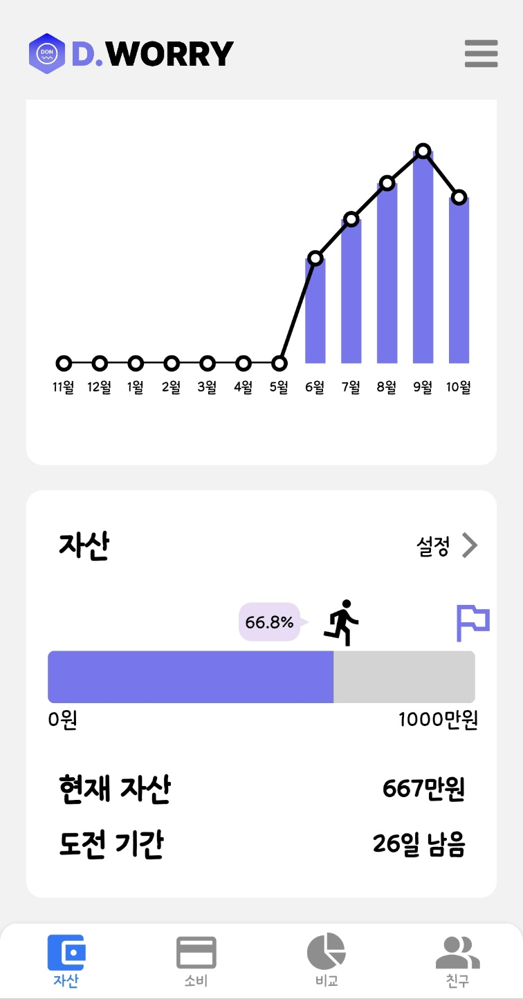
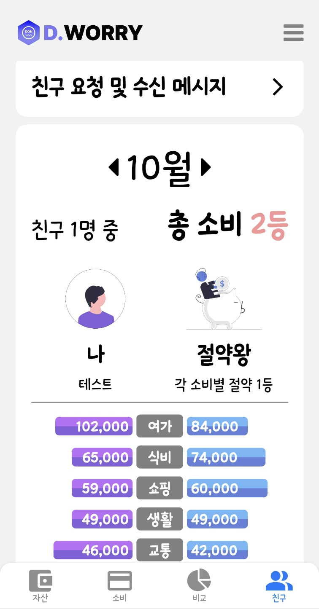

## 💰 DON WORRY, DON’T WORRY

### 사용자 소비 관리 및 개선 서비스

### SSAFY 9기 특화 프로젝트

## 👩‍👩‍👧‍👧 팀원 소개

**유호재** : `팀장` ,  `BackEnd` : Spring Cloud 서버 구현, 자산 관련 API 구현, 카드 관련 API 구현

**나종현** : `FrontEnd` : 더치페이 API 연결, 지문 인증 구현, 앱 배포, 드래그 바 구현

**유승민** : `BackEnd` : 회원관련 API 구현, Spring Batch를 통한 일자별 더미데이터 생성, Spring security&jwt 설정

**이태성** : `FrontEnd` : Auth관련 API 연결(로그인, 회원가입, 소셜로그인 등), 피그마 제작 및 디자인, 거래 내역과 금액 API를 활용한 1대 1 비교 구현 (그래프 라이브러리 활용), 친구 관련 API 연결 (친구 추가, 친구 목록 등), 소식 알림 API 연결

**김동현** : `Infra` ,`BackEnd` : 더치페이 알고리즘 구현, 더치페이 API 구현, 백엔드 서버 배포

**홍경환** : `FrontEnd` : 자산, 자산목표 관련 페이지 제작, 송금 관련 페이지 제작, React Native 달력, 그래프 라이브러리 활용한 기능 구현

## 🔗 프로젝트 개요

### 💡 기획 배경

SNS 등이 활발해지며, 사람들은 자신의 생활을 노출합니다. 하지만 사실적인 내용이 아닌 과장된 생활을 노출하며, 이를 보는 사람들은 상대적 박탈감, 또는 회의감을 느낄 수 있습니다. 현재 SNS와 같이 사람들이 소비생활을 노출하고, 박탈감을 느끼게 되는 플랫폼은 다양하지만, 소비를 개선하고 저축을 하며 살아가는 사람들을 위한 서비스가 부족하다고 생각하였습니다.

저축을 공유하는 서비스가 부족하다는 점에 초점을 맞추어 사람들이 소비 습관을 공유하여, 서로 간 개선점을 찾을 수 있고, 현재 사용자가 위치한 자산 순위를 제공하여 자금에 대한 목표를 세울 수 있는 서비스를 구현하고자 하였습니다.

※ 마이데이터 사용 불가로 은행과 카드, 소비내역과 관련된 ERD와 데이터를 구현하여 사용하였습니다.

### 📅 프로젝트 진행 기간

2023.08.21 ~ 2023.10.06

## 🖇️ 주요 기능

### 📊 자산 및 순자산 그래프

- 사용자의 마이데이터를 불러와 계좌, 카드 등을 등록할 수 있습니다.
    - 불러온 계좌의 금액은 내 자산 총액에 포함되며, 계좌별 잔액을 확인할 수 있습니다.
- 자산에 있는 송금 버튼을 통해 계좌이체를 진행할 수 있습니다.
    - 버튼을 누르게 되면 계좌번호를 입력하는 페이지로 이동하며 입력 후 송금 버튼을 누릅니다.
- 순자산 그래프를 통해 월별 순자산의 변동사항을 조회할 수 있습니다.
- 목표의 설정버튼을 누르면 목표를 생성할 수 있습니다
    - 설정버튼을 누르게 되면 목표금액과 목표일을 설정할 수 있습니다.
    - 금액과 목표일을 입력할 경우 남은 금액과 남은 날짜가 표시됩니다.

### 💳 소비조회 및 더치페이

- 등록된 카드를 선택하면 해당 카드로 지출한 카드사용내역을 월별로 확인할 수 있습니다.
- 소비내역를 클릭하면 카테고리 별 소비내역을 확인할 수 있습니다.
- 소비내역 중 하나를 클릭하면 해당 소비내역을 변경할 수 있는 모달창이 생성됩니다.
    - 모달창에서 더치페이 버튼을 클릭할 경우 해당 소비에 대한 더치페이를 진행할 수 있습니다.
    - 모달창에서 현재 소비내역의 카테고리를 변경할 수 있습니다.
- 사용자는 더치페이 버튼을 클릭하면 더치페이 요청 페이지로 이동합니다.
    - 더치페이 요청 페이지에서 친구 목록을 통해 더치페이 인원을 추가할 수 있습니다.
    - 더치페이 정산은 첫번째 직접 입력, 두번째 1/n 요청 두가지를 지원합니다.
    - 요청받은 사용자는 더치페이 현황에 요청받은 더치페이를 조회할 수 있습니다.
    - 더치페이 현황에 있는 송금하기 버튼을 통해 금액을 송금할 수 있습니다.
    - 더치페이 송금을 하면 소비내역에 더치페이가 적용되어 결제 금액이 아닌 소비된 정확한 금액을 조회할 수 있습니다.

### 👬 친구추가 및 비교

- 친구를 이메일을 입력해서 추가할 수 있습니다.
- 친구를 추가하게 되면 친구의 거래 내역을 데이터로 불러옵니다.
- 불러온 데이터에는 카테고리(식비, 교통비 등 6개)별 금액이 포함되어 있습니다.
- 이를 바탕으로 현재 나의 카테고리 별 금액과 친구의 카테고리 별 금액을 비교할 수 있습니다.
- 해당 월에 따른 카테고리별 비교를 통해 과소비를 방지할 수 있습니다.

|                 송금 1                |                 송금 2                 |                송금 3                |                송금 4                |              송금 5              |
| :-----------------------------------------: | :-----------------------------------------: | :---------------------------------------: | :--------------------------------: | :----------------------------------: |
|  |  |  |  |  |

|                 순자산 그래프                 |                 목표 1                 |                목표 2                |                잔고                 |              카드내역 조회              |
| :-----------------------------------------: | :-----------------------------------------: | :---------------------------------------: | :--------------------------------: | :----------------------------------: |
|  |  |  |  |  |

|                 소비내역 조회                 |                 더치페이 요청 1                 |                더치페이 요청 2                |                더치페이 완료                |              더치페이 결과 1             |
| :-----------------------------------------: | :-----------------------------------------: | :---------------------------------------: | :--------------------------------: | :----------------------------------: |
|  | .jpg) |  |  |  |

|                 더치페이 결과 2                 |                 친구와 비교                 |                친구 요청하기 1               |                친구 요청하기 2             |              친구 요청 확인              |
| :-----------------------------------------: | :-----------------------------------------: | :---------------------------------------: | :--------------------------------: | :----------------------------------: |
|  |  |  |  |  |

|            친구 요청 결과                      |                 마이페이지 1                 |                마이페이지 2                |                내소식                 |              절약왕과 비교             |
| :-----------------------------------------: | :-----------------------------------------: | :---------------------------------------: | :--------------------------------: | :----------------------------------: |
|  |  |  |  |  |

